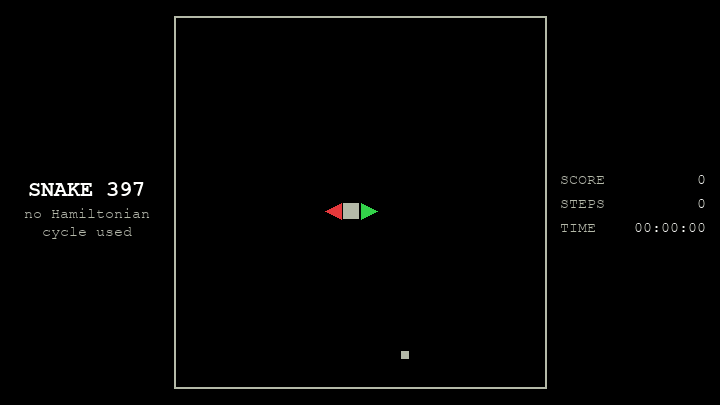
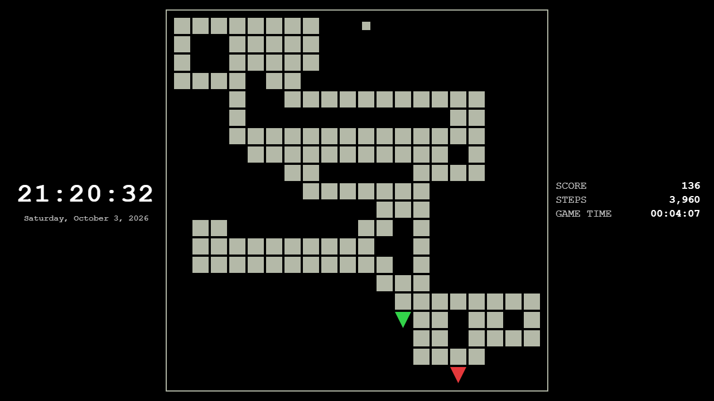
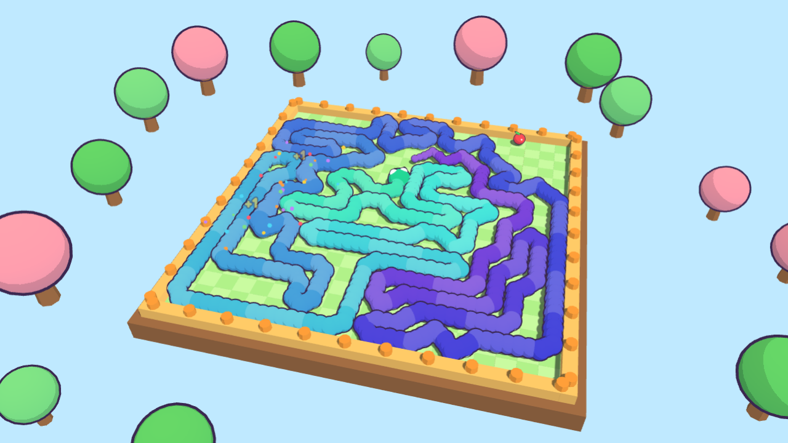

# SNAKE397

A Snake AI that plays a **perfect 397-point game** (the maximum on a 20×20 board: 400 cells minus the 3 the snake starts with),
plus two ways to watch it: a **3D cartoon viewer** in the browser and a real **Windows screensaver**.



*A whole 397-point game as a time-lapse (about 26,000 steps). Rendered by `make_gif.py` from a recorded game.*

| Screensaver (classic 2D) | 3D viewer |
|---|---|
|  |  |

**中文简介：** 用强化学习（DQN）+ 搜索训练的贪吃蛇 AI，能吃满 20×20 棋盘的 397 分。
可以在浏览器里看 3D 卡通回放，也可以当作 Windows 屏保（多块屏幕同步、一键安装、**不需要 Python**）。
安装方法见下面的 [Install the screensaver](#install-the-screensaver-windows-no-python-needed)。

---

## Quick start

| I want to… | Do this | Needs Python? |
|---|---|---|
| Use it as a Windows screensaver | Download the repo, run `install_screensaver.bat` | **No** (Windows 10/11 + Microsoft Edge) |
| Watch the 3D version | Open `snake3d.html` in a browser | No (needs internet to load three.js) |
| Retrain / re-search / re-record games | `pip install -r requirements.txt`, then the scripts below | Yes |

## Install the screensaver (Windows, no Python needed)

1. Download the repository (green **Code** button, then *Download ZIP*) and unzip it.
2. Double-click `install_screensaver.bat` (or run `install_screensaver.bat 10` for a 10-minute idle time; the default is 5).
   It copies three files to `%LOCALAPPDATA%\SnakeSaver\app` and sets the screensaver in your user registry. No admin rights.
3. Preview at once: `%LOCALAPPDATA%\SnakeSaver\app\SnakeSaver.scr /s`. Any key press or mouse move quits it.
4. Change the idle time or switch it off in *Settings > Personalization > Lock screen > Screen saver*.
5. Remove everything with `uninstall_screensaver.bat`.

What it does:

- One full-screen Edge window per monitor. All monitors show **the same game in lockstep** (each frame is computed from a shared clock).
- Classic look: black background, green-phosphor look (everything green on black), light and dark body blocks, a bright triangle head and a small half-circle tail, SCORE / STEPS / GAME TIME and a clock.
  Constant 8 steps per second (1x), no smoothing.
- Only the primary monitor makes sound (square-wave blips). Any input quits it and cleans up every process it started.
- Progress is saved in `%LOCALAPPDATA%\SnakeSaver\progress.txt`, so the game continues next time instead of restarting.

Requirements and caveats: Windows 10/11 and Microsoft Edge (preinstalled). `SnakeSaver.scr` is an unsigned binary, so SmartScreen may warn
about it. If you would rather not trust it, read `screensaver/SnakeSaver.cs` (about 270 lines) and rebuild it with `python build_screensaver.py`,
which uses the C# compiler that ships with Windows (`csc.exe`). The `.scr` looks for `snake_classic.html` next to itself first, so the
folder can be moved or copied anywhere.

## 3D viewer

`snake3d.html` is a three.js scene: a toy-like board with trees, a snake whose colour runs along its body, a head with eyes,
particles and "+1" pop-ups when it eats, camera moves, and synthesized music and sound effects (Web Audio, no audio files).

```
# just open it:
snake3d.html
# or serve it:
python -m http.server 8765      # then http://127.0.0.1:8765/snake3d.html
```

- `snake3d.html#saver` hides all UI and loops through the 10 recorded perfect games. `start_screensaver.bat` opens that in Edge kiosk mode.
- Browsers only allow sound after a click, so the 3D page stays silent until you click once.
- three.js r128 is loaded from cdnjs, so the 3D page needs internet access. The classic screensaver is fully offline.

**Live mode.** The AI computes every move on the spot while the page plays it:

```
python live_server.py          # then http://127.0.0.1:8770/snake3d.html#live
```

## How it works

```
snake_env.py --> rl_train.py --> rl_snake_best.pth --> rl_search.py --> record_games.py --> replays_wins.js
(game + 27       (Double+Dueling  (trained network)    (food-directed   (keep only the      (moves of 10 perfect
 features)        DQN)                                   lookahead)       397-point games)    games, plain JS)
                                                                                                    |
                                  snake_classic.html <-- SnakeSaver.scr ----------------------------+
                                  snake3d.html       <------------------------------------------------+
```

### 1. Environment: `snake_env.py`
A headless 20×20 Snake accelerated with **numba**. The state is 27 features, including a **flood-fill** count of reachable free cells
(so the snake can tell when it is about to wall itself in) and whether the tail and the food are reachable.

### 2. Reinforcement learning: `rl_train.py`
**Double + Dueling DQN** in **PyTorch** with n-step returns and 16 parallel environments. A **safety mask** removes any action after which the
snake's tail would no longer be reachable. This one rule did the most to lift the average score, to about 290.

### 3. Search on top: `rl_search.py`
For each move it simulates a virtual snake: BFS to the food through time-varying obstacles (the tail moves away as the snake advances), then it checks
that the tail is still reachable after eating. Over 32 games the network plus mask averages about 289; with search about 345 to 353 (median about 390).

### 4. Perfect games: `record_games.py`, `test_replays.py`
Search alone reaches 397 in only about 3% of games, so `record_games.py` runs many seeds and **keeps only the games that reach 397**
(`python record_games.py --wins 10 --seed0 20000 --out replays_wins.js`). The screensaver replays those recorded moves; it does not run the network.
`test_replays.py` replays every recording in an independent environment and checks that each move is legal and the final score is really 397.

> **Honest note.** The AI does not win every game. A learned policy tends to seal off free cells with its own body late in the game, and only a
> Hamiltonian cycle guarantees 397, which this project deliberately does not use. What you see in the screensaver is the AI's real play, filtered for the games that succeeded.

### 5. Viewers
- `snake_classic.html`: plain 2D canvas, redrawn only when something changes (a step, the clock, the end-of-game blink). It is a pure function of a
  shared clock, which is what keeps several monitors in sync.
- `snake3d.html`: three.js, cartoon materials, Web Audio.
- `screensaver/SnakeSaver.cs`: a C# launcher (.NET Framework, WinForms, WMI, P/Invoke). It starts one Edge `--kiosk` window per
  monitor, detects input with `GetLastInputInfo`, keeps the windows on top, reads progress from the window titles, and kills the whole process tree on exit.
  GPU acceleration is left **on**: in a real screensaver run it used about 6 to 12% GPU, while `--disable-gpu` was worse (about 19% GPU plus a full CPU core).

## Results (and what this project does not do)

**No Hamiltonian cycle.** The easy way to guarantee a full board is to walk a fixed cycle through all 400 cells forever. This project does not do that.
The snake decides every move itself, with a neural network plus a short lookahead, and it takes direct routes to the food.

| Method (20×20, max 397) | Average score | Share of the maximum | Perfect games |
|---|---|---|---|
| Network + safety mask | about 289 | about 73% | not measured |
| Network + food-directed search | **about 345 to 353** (median about 390) | **about 87 to 89%** | **about 3%** |

- Measured over 32 games per setting. The percentage is simply the average score divided by 397, so on average the snake fills roughly 87 to 89% of the board by itself.
- Roughly 1 game in 30 ends with all 397 apples. The screensaver shows recorded games from that 3%, so it always looks perfect (see "Perfect games" below).
- It does not need a GPU to *watch*: the screensaver and the viewers only replay recorded moves. Training uses a GPU when one is available (see `device` in `rl_train.py`).

## Tech stack

| Part | Technology |
|---|---|
| Training | Python, PyTorch (Double + Dueling DQN, n-step), NumPy |
| Fast simulation | numba (`@njit`) |
| Search | BFS with time-varying obstacles, flood fill |
| 3D viewer | three.js r128, WebGL, Web Audio API |
| Classic viewer | HTML5 canvas 2D, Web Audio (square-wave blips) |
| Windows screensaver | C# (.NET Framework 4, compiled with the built-in `csc.exe`), Microsoft Edge kiosk mode, Win32 API |
| Tests | pytest |

## Tests and tools

```
pip install -r requirements.txt
python -m pytest                      # environment rules + replay validation
python rl_train.py                    # train
python rl_search.py --goal            # evaluate search on top of the network
python rl_demo.py                     # pygame demo
python build_screensaver.py           # rebuild SnakeSaver.scr
```

Test the screensaver without waiting for the idle timer: `screensaver\SnakeSaver.scr /s /test 15`
(in Git Bash prefix the command with `MSYS_NO_PATHCONV=1`, otherwise `/s` is rewritten as a path).

## Repository layout

```
snake_classic.html, replays_wins.js, screensaver/SnakeSaver.scr   everything the screensaver needs
install_screensaver.bat, uninstall_screensaver.bat                one-click setup / removal
snake3d.html, replays.js, live_server.py                          3D viewer and live mode
snake_env.py, rl_train.py, rl_search.py, rl_demo.py               RL environment, training, search
record_games.py, test_replays.py, test_snake_env.py               recording and tests
rl_snake_best.pth                                                 trained network
*_dqn*.py, outdated/, docs/legacy-approaches.md                   earlier NEAT / DQN experiments
```

## License

Apache-2.0, see [LICENSE](LICENSE).
